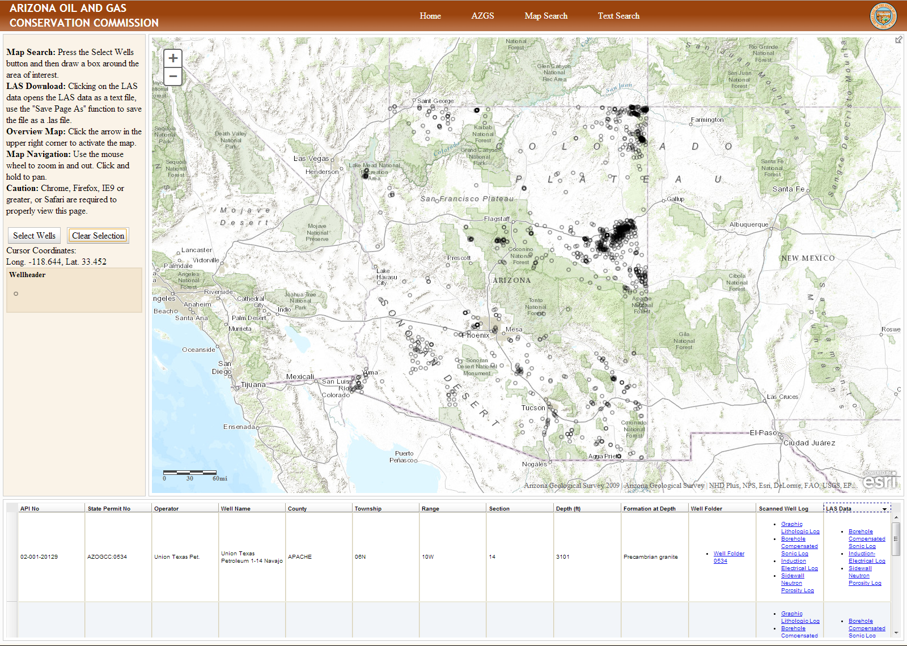

#Oil and Gas Viewer
==================

Web application for locating and viewing oil and gas well data. This data is provided by the [Arizona Oil and Gas Conservation Commission] (http://azogcc.az.gov/) and the [Arizona Geological Survey] (http://azgs.az.gov/).

This application allows users to download pdf copies of well folders, scanned well logs and LAS well logs.

This application uses the data provided by the AZWellHeaders service on the Arizona Geological Survey's ArcGIS web server. This service provides the well location and symbology that are displayed in the application.

The application uses the ArcGIS Service endpoint to obtain this data from the service instead of using the WMS or WFS services like other open source JavaSript APIs.

The application creates the hyperlinks for each feature by reading the RelatedResource field. By using a series of loops to look for "|" pipes and then "," commas. When the application finds a pipe it splits the string and stores it in a variable. The pipes separate the different types of logs and their web address from other logs. The application then loops through these new strings and looks for commas and then it splits them into two new strings. These two strings are then combined using the href function in html to build the hyperlinks displayed in the info window or data grid.
